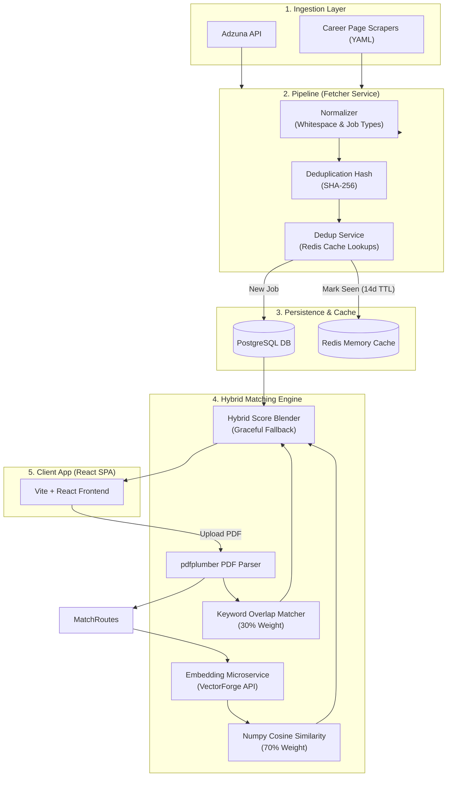

# RoleSync

RoleSync is an enterprise-grade, AI-powered job aggregation, normalization, and semantic matching platform. It ingests job listings from multiple sources (public APIs and company career pages), standardizes and deduplicates the data, and ranks jobs against uploaded PDF resumes using a hybrid vector search and keyword matching engine.

---

## Architecture & System Flow

RoleSync is designed as a decoupled full-stack application. The backend is built with FastAPI and runs scheduled background workers for fetching, indexing, and alerting. The frontend is a highly responsive Single Page Application (SPA) built with React and Vite.



---

## Core System Features

| Feature | Technical Implementation |
| :--- | :--- |
| **Job Aggregation** | Periodic background ingestion fetches raw job posts from the **Adzuna API** and company career sites (Google, Meta, Microsoft) parsed using YAML-based DOM selector rules. |
| **Deduplication** | Normalizes titles, locations, and link parameters before hashing. Compares a computed lowercase SHA-256 signature (`title\|company\|location\|url`) against **Redis (14-day TTL)** cache and persistent **PostgreSQL DB** constraints to avoid duplicates. |
| **Normalization** | Cleans white space, standardizes URLs (canonicalizes schemes and hosts), and maps job types (such as `internship`, `contract`, and `full-time`). |
| **Hybrid Resume Matching** | Ingests PDF resumes via `pdfplumber`, extracts text keywords, and generates vector embeddings. It ranks jobs using a hybrid blender: **70% semantic embedding similarity** (using cosine similarity on high-dimensional vectors via the external embedding microservice) + **30% keyword overlap**. Includes a keyword-only fallback. |
| **Smart Alerts** | Allows users to create filters for keyword matching (max 5 per email). The background alert checker evaluates alerts against newly ingested jobs and sends automated notifications via SMTP. |
| **JWT Authentication** | Secure signup, login, and profile fetching protected routes utilizing JSON Web Tokens (`python-jose`) and salted password hashes (`passlib` + `bcrypt`). |
| **Background Scheduler** | Background worker thread run by `APScheduler` managing job ingestion, database-to-cache sync, incremental embedding backfills, email dispatch, and database pruning. |

---

## Tech Stack

### Backend
* **Language & Core:** Python 3.11+, FastAPI (high performance async REST API), Pydantic v2 (data modeling & validation).
* **Database & Caching:** PostgreSQL (SQLAlchemy v2 ORM), Redis (caching and deduplication records).
* **Scraping & Ingestion:** `httpx` (async requests), `BeautifulSoup4` + `lxml` (DOM parsing), `PyYAML` (scraping configs).
* **AI & Mathematics:** `numpy` (vector arithmetic & cosine similarity metrics).
* **Resume Parsing:** `pdfplumber` (text and schema extraction).
* **Auth & Alerts:** `python-jose` (JWT handling), `passlib[bcrypt]` (secure credentials), `APScheduler` (task management).

### Frontend
* **Core SPA:** React 18, React Router v6, Vite (module bundling & hot reloading).
* **Styling & UI:** Tailwind CSS v3, Lucide React (vector iconography).
* **State Management:** Custom React Context providers (`AuthContext`, `ThemeContext`).

### Infrastructure & Deployment
* **Backend:** Dockerized image running under `gunicorn` + `uvicorn` workers hosted on Render.
* **Frontend:** Single Page Application (SPA) hosting and routing configuration on Vercel.

---

## Project Structure

```
job-aggregator/
├── backend/
│   ├── app/
│   │   ├── api/                  # API Routers & Schemas
│   │   │   ├── auth_routes.py    # /auth/register, /auth/login, /auth/me
│   │   │   ├── job_routes.py     # GET /jobs, GET /jobs/{id}
│   │   │   ├── alert_routes.py   # CRUD endpoints for alerts
│   │   │   ├── match_routes.py   # POST /match/resume (PDF upload)
│   │   │   ├── auth_dependencies.py # JWT bearer token retrieval
│   │   │   └── schemas.py        # Pydantic models for request/response
│   │   ├── fetchers/             # Ingestion Connectors
│   │   │   ├── base.py           # Abstract base fetcher class
│   │   │   ├── adzuna_api.py     # Adzuna API fetcher client
│   │   │   └── career_page.py    # Configuration-driven HTML scraper
│   │   ├── services/             # Business Logic & Workflows
│   │   │   ├── job_matcher.py    # Hybrid semantic & keyword ranking
│   │   │   ├── embedding_service.py # Vector embedding microservice client
│   │   │   ├── dedup_service.py  # SHA-256 + Redis TTL state matching
│   │   │   ├── normalizer.py     # Standardizes incoming job structures
│   │   │   ├── resume_parser.py  # PDF text extraction & stopword tokenizer
│   │   │   ├── alert_service.py  # Evaluates alert filters against new jobs
│   │   │   ├── email_service.py  # Handles SMTP email construction
│   │   │   ├── email_queue_service.py # Redis-backed notification queue
│   │   │   ├── fetcher_service.py # Core fetcher and parser orchestrator
│   │   │   ├── job_repository.py # CRUD operations for job schema
│   │   │   └── redis_sync_service.py # Syncs active jobs structure to Redis cache
│   │   ├── models/               # SQLAlchemy Database Schemas
│   │   │   ├── job_model.py      # jobs table model (includes vector metadata)
│   │   │   ├── alert_model.py    # user_alerts table model (JSON filters)
│   │   │   └── user_model.py     # users table model
│   │   ├── core/                 # Shared Configuration & Infrastructure
│   │   │   ├── config.py         # BaseSettings configuration loader
│   │   │   ├── database.py       # DB engine creation & session pool
│   │   │   ├── init_db.py        # Table initialization
│   │   │   ├── jwt_handler.py    # Hash utilities & token generation
│   │   │   ├── redis.py          # Redis connection instance
│   │   │   └── scheduler.py      # Background APScheduler worker setup
│   │   ├── configs/companies/    # YAML scraper selectors
│   │   │   ├── google.yaml
│   │   │   ├── meta.yaml
│   │   │   └── microsoft.yaml
│   │   └── main.py               # FastAPI entrypoint, middleware, CORS
│   ├── scripts/                  # Command Line Operations & Migrations
│   │   ├── fetch_and_save.py     # Manual trigger to run ingest, embed, & alert
│   │   └── backfill_embeddings.py # Bulk embedding backfill migration utility
│   ├── tests/                    # Core Verification Scripts
│   │   ├── test_fetchers.py      # Command line test for ingestion fetchers
│   │   ├── test_normalization_dedup.py # Assertions for normalizers and Redis state
│   │   └── test_resume_match.py  # Standalone resume parser keyword test
│   ├── Dockerfile
│   └── requirements.txt
│
├── frontend/
│   ├── src/
│   │   ├── pages/                # Route-level React SPA page layouts
│   │   │   ├── LandingPage.jsx   # Public marketing homepage
│   │   │   ├── SignIn.jsx        # Login layout
│   │   │   ├── SignUp.jsx        # Signup layout
│   │   │   ├── JobSearch.jsx     # Job list, filtering, and search options
│   │   │   ├── AlertManager.jsx  # Configures user search alerts
│   │   │   ├── ResumeMatch.jsx   # Uploads PDF and shows matched positions
│   │   │   ├── About.jsx
│   │   │   ├── Blog.jsx
│   │   │   ├── Contact.jsx
│   │   │   ├── Privacy.jsx
│   │   │   └── Terms.jsx
│   │   ├── components/           # Shared UI Layout Elements
│   │   │   ├── landing/          # Navigation, headers, footers
│   │   │   │   ├── DarkLayout.jsx # Public wrapper layout
│   │   │   │   ├── AppDarkLayout.jsx # Authenticated wrapper layout
│   │   │   │   ├── LandingNavbar.jsx
│   │   │   │   ├── AppNavbar.jsx
│   │   │   │   └── ...
│   │   │   ├── ProtectedRoute.jsx # client auth check wrapper
│   │   │   └── LoadingSpinner.jsx
│   │   ├── context/              # Context Providers (Auth, Theme)
│   │   │   ├── AuthContext.jsx   # Holds current token and profile state
│   │   │   └── ThemeContext.jsx  # Dark/Light system config
│   │   ├── services/
│   │   │   └── api.js            # API request wrapper with global handler
│   │   ├── App.jsx               # Routes Definition
│   │   ├── main.jsx              # React app client root entry
│   │   └── index.css             # Main styling index containing custom tokens
│   ├── index.html
│   ├── vite.config.js
│   ├── tailwind.config.js
│   ├── vercel.json
│   └── package.json
│
├── render.yaml                   # Production Render service configuration
└── README.md                     # Project documentation
